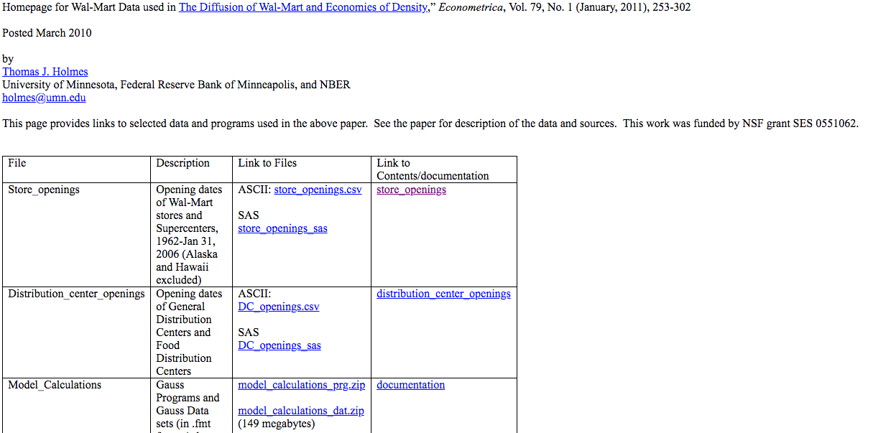
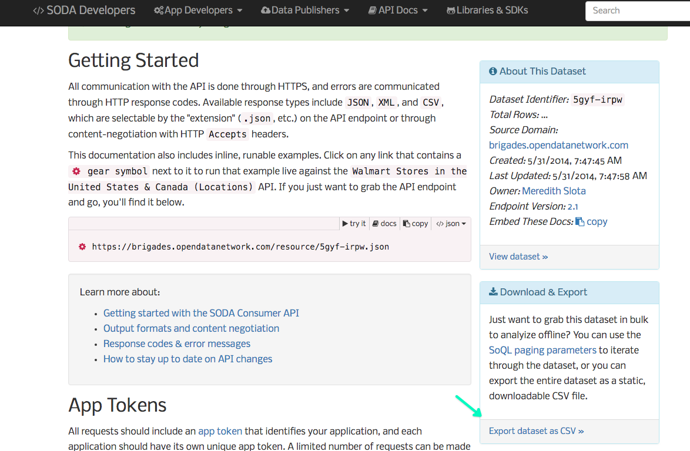

# Walmart

data and data processing scripts for Walmart data

## Data Sources

### Data of creation data

I pulled data from [Thomas J. Holmes website](http://users.econ.umn.edu/~holmes/data/WalMart/).  The image below shows the [store openings CSV file](http://users.econ.umn.edu/~holmes/data/WalMart/store_openings.csv)

### Spatial data

[Socrata has lat-long data for Walmarts](https://dev.socrata.com/foundry/brigades.opendatanetwork.com/5gyf-irpw/no-redirect). They have an API and an [R package to download data](https://github.com/Chicago/RSocrata).  I just downloaded the CSV.

It looks like [Walmart has an API](https://developer.walmartlabs.com/docs/read/Store_Locator_API) to get addresses as well.

## Created Artifacts

The two datasets did not have a join key.  I used `scripts/walmart_datajoin.R` to do fuzzy matching with address and zip code.  I did not check all the matches but felt good enough about the pairing for my needs. The three datasets are;

1. [walmart_timeloc.csv](walmart_timeloc.csv): Has over 3,000 joined observations between the two data sets above.  As such we have the open date and spatial mapping.
2. [walmart_time_nomerge.csv](walmart_time_nomerge.csv): Has those locations that did not seem to match using my fuzzy matching process.
3. [walmart_loc_nomerge.csv](walmart_loc_nomerge.csv): Has the Walmart locations that did not seem to match easily. I did remove the Canada stores before attempting to merge.